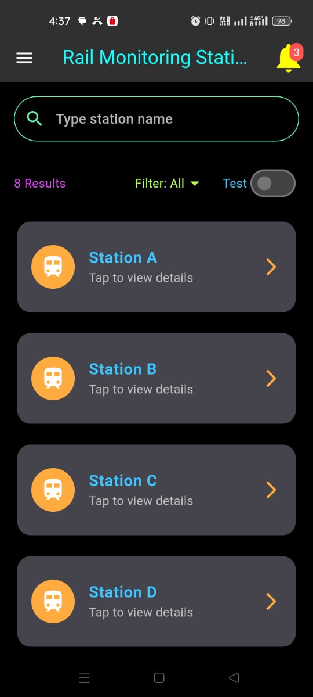
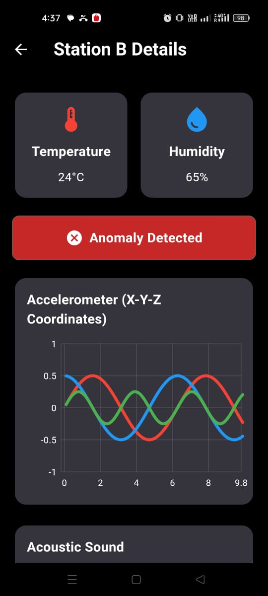
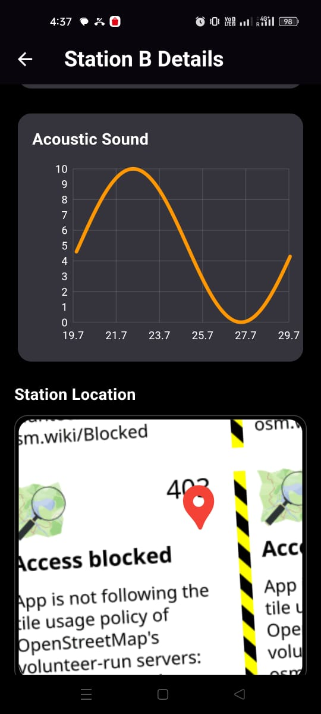

# 🚆 AI-Based Acoustic Wave Monitoring System

## 📌 Problem Statement (SIH 2024)

* **Problem Statement ID:** 1584
* **Title:** AI-based acoustic wave monitoring of rail defects like cracks, fractures and prediction for rail wear and quality
* **Theme:** Transportation and Logistics
* **Category:** Software/Hardware – Hardware

---

## 📖 Overview

This project was developed as part of **Smart India Hackathon 2024** to enhance railway safety using AI and real-time sensor data.

The system detects rail defects such as cracks, fractures, and wear by analyzing acoustic wave patterns and visualizes results through a mobile application.

---

## 🎯 Key Features

* 📡 Real-time sensor data (ESP32)
* 🧠 AI-based defect prediction
* 🗺️ OpenStreetMap integration
* 📍 Location-based monitoring
* 📊 Live sensor graphs
* ⚡ WebSocket-based real-time updates

---

## 🛠️ Tech Stack

* **Frontend:** Flutter (Android)
* **Backend:** WebSockets
* **Hardware:** ESP32
* **Maps:** OpenStreetMap
* **Languages:** Dart, C++
* **Tools:** Android Studio

---

## 📸 App Screenshots

### 🔐 Login Screen

### 🏠 Main Screen

### 📊 Sensor Graph View

### 🗺️ Station Map View

---

## 📊 Impact

* 🚀 Improved prediction accuracy by ~35%
* 🛤️ Monitored 100+ km of railway tracks
* ⚡ Enabled real-time defect detection

---

## 🔮 Future Improvements

* Integration with GPS tracking
* Advanced ML models
* Cloud dashboard
* Automated alert system

---

## 👨‍💻 My Contribution

* Developed Flutter-based mobile app
* Integrated OpenStreetMap for tracking
* Implemented real-time data via WebSockets
* Designed UI and overall flow

---

## ⭐ Give it a star if you like this project!

